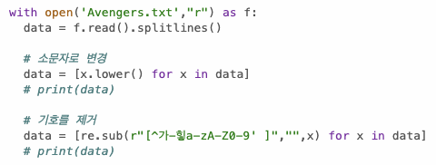

# AIFFEL Campus Online Code Peer Review Templete
- 코더 : 이찬규
- 리뷰어 : 정범준


# PRT(Peer Review Template)
- [x]  **1. 주어진 문제를 해결하는 완성된 코드가 제출되었나요?**

        모든 요구사항을 완벽하게 충족했습니다.
        -텍스트 파일 불러오기
        -소문자 변환
        -특수기호 삭제
        -단어 단위로 분리
        -빈도순으로 정리
        -새로운 인덱스 부여
        -input에 따른 인덱스 출력
        
    
- [x]  **2. 전체 코드에서 가장 핵심적이거나 가장 복잡하고 이해하기 어려운 부분에 작성된 
주석 또는 doc string을 보고 해당 코드가 잘 이해되었나요?**
    
        해당 코드 혹은 청크가 어떤 기능을 수행하는지 어떤 목적인지
        주석이 세세히 달려있어서 이해하기 쉽습니다.

        
- [x]  **3. 에러가 난 부분을 디버깅하여 문제를 해결한 기록을 남겼거나
새로운 시도 또는 추가 실험을 수행해봤나요?**
    
        출력 데이터를 확인하기 위해 사용한 print함수 흔적들이 있습니다.
        Counter 정렬 문제를 해결하기 위해 sorted를 찾아낸 노력이 보입니다.

        
- [ ]  **4. 회고를 잘 작성했나요?**
    
        회고가 주석으로 작성되어있지는 않지만
        직접 발표하는 과정에서 이야기해주셨습니다.

        
- [x]  **5. 코드가 간결하고 효율적인가요?**
    
        컴프리헨션을 아주 적극적으로 사용하여
        전체 코드를 매우 간결하게 작성하려 노력했습니다.
        또한 with를 사용하여 수동으로 닫는 과정을 생략하였습니다.

        


# 회고(참고 링크 및 코드 개선)
```
# 리뷰어의 회고를 작성합니다.
# 코드 리뷰 시 참고한 링크가 있다면 링크와 간략한 설명을 첨부합니다.
# 코드 리뷰를 통해 개선한 코드가 있다면 코드와 간략한 설명을 첨부합니다.
```
